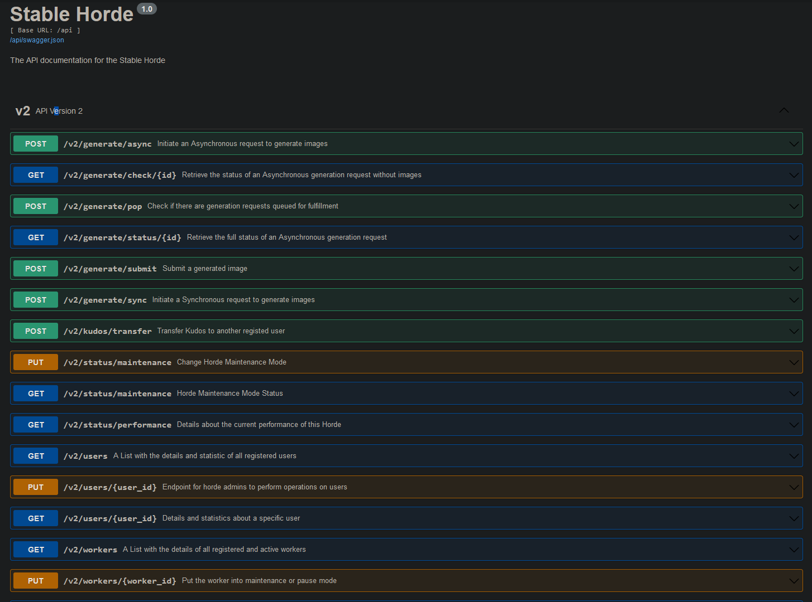

# Stable Horde

A giant crowdsourced distributed cluster for Stable Diffusion. It allows people without a powerful GPU to use SD by relying on spare/idle resources provided by the community.
It also allows clients other than SD, such as games and apps, to use KAI-provided generations.


# Registering

To use the horde you need to have a registered amount, or use anonymous mode.

To register an account, go to https://stablehorde.net/register and login with one of the available services. Once you do you'll see a form where you can put a username. Add one in and it will automatically store a user object for you and provide an API key to identify you. 
Store this API key and use it for your client or bridge.
By logging in first, you can change your username and API key at any time. 
Be aware that the account is unique per service, so even if you use the same email for discord and google, your user ID will be different for each!
We don't store any identifiable information other than the ID string sent by the oauth for your user. We only use this for user uniqueness, and no other purpose.

If you want, you can also create a pseudonymous account, without logging in with oauth. However *we will not maintain such accounts*. If you lose access to it, you'll have to make a new one. If someone copies your API Key, they can impersonate. You cannot change the username or API key anymore etc. If you don't want these risks, login to one of the available services instead.

If you do not want to login even with a pseudonymous account, you can use this service anonymously by using '0000000000' as you API key. However your usage and contributions will be not be tracked. Be aware that if this service gets too overloaded, anonymous mode might be turned off!

The point of registering is to track your usage and your contributions. The more you contribute to the Horde, the more priority you have. [Read about this here](https://dbzer0.com/blog/the-kudos-based-economy-for-the-koboldai-horde/)

# Generating Prompts

### GUI

We provide [a client interface](https://dbzer0.itch.io/stable-horde-client) requiring no installation and no technical expertise


## Command Line

I have provided a small python script with which you can use to call the horde.

1. Git clone [this repository](https://github.com/db0/Stable-Horde)
1. Make sure you have python3 installed
1. Open a git bash (or just bash in linux)
1. Download the cli requirements with `python -m pip install -r cli_requirements.txt --user`
1. Run `./cli_requests.py` 

You can use `./cli_requests.py -h` to see the command line arguments to use

You can make a copy of `cliRequestData_template.py` into `cliRequestData.py` and edit it, to use common variables for your generations. Command line arguments will always take precedence over `cliRequestData.py` so you can use them to tweak your generations slightly.


## REST API

[Full Documentation](https://stablehorde.net/api/v1)



You can also use the REST API directly. Be aware that this will return a base64 encoded image, so it will flood your output. This is not recommended unless you know what you're doing!

```
curl -H "Content-Type: application/json" -d '{"prompt":"A horde of stable robots", "params":{"n":1, "width": 256, "height": 256}, "api_key":"0000000000"}' https://stablehorde.net/api/v1/generate/sync
```

The "params" dictionary is the same as use by the Stable API Webui. Documentation will be forthcoming.

Pass an API Keyin order to track your usage.

## Specifying servers

You can optionally specify only specific servers to generate for you. Grab one or more server IDs from `/servers` and then send it with your payload as a list in the "servers" arg. Your generation will only be fulfiled by servers with the specified IDs


# Joining the horde

1. Go to this fork of the [stable diffusion webui](https://github.com/db0/stable-diffusion-webui) and follow the install instructions as normal but do not start it. If you already the upstream version of this repo, you can simply change your origin to my fork and pull again.
1. (Optional) Make a copy of `scripts/bridgeData_template.py` into `scripts/bridgeData_template.py`. If you do not do this step, you will contribute anonymously.
1. (Optional) Edit `scripts/bridgeData_template.py` and put details for your server such as the API key you've received, so that you can receive Kudos. If you do not do this step, you will contribute anonymously.
1. Start the software with webui.(cmd|sh) as usual.

My fork has been modified to start in bridge mode, but you can edit `relauncher.py` to make it start as a normal webui as well.


## Advanced Usage: Local + Horde SD

TBD