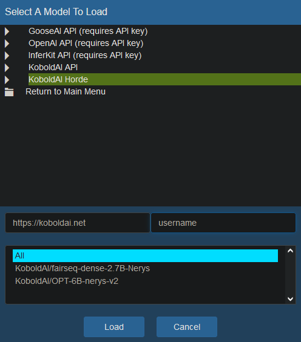

# KoboldAI Horde information

Information specific to the Text generation

# Generating Prompts

## REST API

[Full Documentation](https://koboldai.net/api/v1)

### Specifying servers

You can optionally specify only specific servers to generate for you. Grab one or more server IDs from `/servers` and then send it with your payload as a list in the "servers" arg. Your generation will only be fulfiled by servers with the specified IDs

### Specifying softprompts

You can optionally specify only specific softprompts to use with generation. You can type all or part of the softprompt **filename** that you want to be used. Only servers which can find that softprompt name for their model will fulfil your request. If you don't specify anything, or specify an empty list, then any active softprompts will be turned off for your generation.

The softprompts you specify need to exist on the KAI server side. If you want to be able to generate using a specific softprompt on other servers, distribute it and ask people to add it to their softprompts folder.

# Using KoboldAI client

**You KoboldAI client must be using the UNITED branch!**

The United branch of KoboldAI now supports using the bridge directly from its interface. To use it go to the AI menu on the top left, then select Online Services > KoboldAI Horde. In the next window that opens, you have to fill in the url of the Horde (You can use `https://koboldai.net`) and then type a username. If the models window hasn't appeared yet, click away from the textbox and it should. You can select one of more models that you want to use for your generations, or All, if you don't care. Then finally click `Load`.



You can also start KAI directly in horde mode by using the command line in the `play.(sh|bat)` file. Pass the arguments to start a KAI instance in cluster mode like so (Change "0000000000" to your own API KEY, if you have one.)

LINUX

```bash
APIKEY=0000000000
play.sh --path https://koboldai.net --model CLUSTER --apikey ${APIKEY}
```

WINDOWS


```bash
play.bat --path https://koboldai.net --model CLUSTER --apikey 0000000000
```

This will use any available model on the cluster. If you want to use only specific models, pass the wanted modules via one or more `req_model` args. Example `--req_model "KoboldAI/fairseq-dense-13B-Nerys-v2" --req_model "KoboldAI/fairseq-dense-2.7B-Nerys"`

Once the KAI starts in cluster mode, any request will be sent to the cluster

# Joining the horde

[We provide a repository with a little bridge script](https://github.com/db0/KoboldAI-Horde-Bridge) which you can run on your own machine (windows or linux). It will take care of communicating between the KoboldAI Horde and your own KAI Worker. This will allow people to use their own PCs to support the KAI horde.

Please visit that repository for instructions: https://github.com/db0/KoboldAI-Horde-Bridge

# Other Info

The cluster does not save any prompts nor generations locally. It's all stored in memory. Furthermore, requested prompts and their generations are wiped after 10 minutes of inactivity

The bridge also does not save any prompts, but of course this is not under my control as the bridges run locally on the various cluster nodes. As such, you should not prompt with anything you do not want others to see!

This system stores how many tokens you requested to generate, and how many your own servers have generated for others. This is not used yet, but eventually this will be how we balance resources among the users.

# Advanced Usage: Local + Horde KAI

If you want to both play with KAI AND share resources with the community, you can achieve this by running two instances of KAI side by side. One normal one, and one in cluster mode. That way when you're using the clustered KAI, you will ensure there's always at least one instance to serve you (your own), while also taking advantage of any other instances that are onboarded at the time.

1. start KAI as you would normally do with `play.(sh|bat)` and load the model you want.
2. open a terminal window at your KAI installation, and now run `play.(sh|bat)` using a different port in CLUSTER mode. This will start open another KAI window, while leaving your model-loaded KAI intact. Make sure the `req_model` you pass, includes the model loaded in your own KAI instance.

```bash
play.bat --port 5002 --path https://koboldai.net --model CLUSTER --apikey 0000000000 --req_model "KoboldAI/fairseq-dense-13B-Nerys-v2" --req_model "KoboldAI/fairseq-dense-2.7B-Nerys"
```

Now use the CLUSTER KAI to play. You will see the requests being fulfilled by the model-loaded KAI after you press the button.