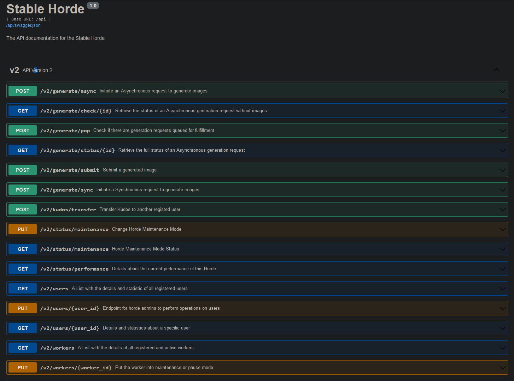

<!--
SPDX-FileCopyrightText: 2022 Konstantinos Thoukydidis <mail@dbzer0.com>

SPDX-License-Identifier: AGPL-3.0-or-later
-->

# Integrating to the AI Horde

This readme will provide information on how you can build software which uses the AI Horde

## REST API

First of all, we provide a fully open and self-documented REST API for all Generative AI functions we support.

[Complete Documentation](https://aihorde.net/api).



## SDK

We have multiple SDK for the AI horde

* [Python: pip](https://pypi.org/project/horde-sdk/) ([Documentation](https://horde-sdk.readthedocs.io/en/latest/))
* [Javascript: npm](https://www.npmjs.com/package/@zeldafan0225/ai_horde)

## The Basics

The workflow to use the AI horde is fairly straightforward.

First choose what kind of generation you want to have. Image, Text, or Alchemy (Image interrogation/manipulation). Depending on which one you'll use, you have to then use a specific set of endpoints.

They all work the same way. First send the payload which describes the generation you want to have. This is specific to the type of generation you want. This will return information about this request and will also even inform you if this request is even possible. You will receive an "id" here which you need to store to query in the next steps.

Once the request is accepted and in-progress, periodically check its status (the horde has a 1 second cache on status so there's no purpose checking more often). The status endpoint will inform you if it's done, how many underlying jobs are still in progress, waiting, or done.

If the request is done, retrieve the content from the `generations` key. This will either be a URL from which to download an image, or the resulting generation if it's text.

You can get the results faster by using the [webhooks](#Webhooks).

### Image Generation Endpoints

Use these endpoints to generate images. Please use the `/check` endpoint for checking if a request is done, and the statud endpoint for retrieving the full results.

1. Initiate the request: `api/v2/generate/async`
2. Check the request status: `api/v2/generate/check`
3. Retrieve the request results: `api/v2/generate/status`
4. Retrieve the submitted parameters: `api/v2/generate/request` (see [Request parameters](#request-parameters))

### Text Generation Endpoints

Use these endpoints to generate text.

1. Initiate the request: `api/v2/generate/text/async`
2. Retrieve the request results: `api/v2/generate/text/status`
3. Retrieve the submitted parameters: `api/v2/generate/text/request` (see [Request parameters](#request-parameters))

### Image Alchemy

Use these endpoints to interrogate or manipulate images.

1. Initiate the request: `api/v2/interrogate/async`
2. Retrieve the request results: `api/v2/interrogate/status`

## Request parameters

The `check` and `status` endpoints only need the request ID, so anyone holding the ID can follow a request's progress and collect its results. The submitted prompt and parameters are not part of those responses. To read them back, call `api/v2/generate/request/<id>` (or `api/v2/generate/text/request/<id>`) with the `apikey` header set to the key that submitted the request. A different user's key is refused, and so is the anonymous key. A shared key can read the requests it submitted, and the owner of a shared key can read the requests submitted through it.

The response has the same shape as the generation input, so it can be posted back to `api/v2/generate/async` as-is. The values are the ones the AI Horde recorded: parameters left out of the submission come back with their defaults filled in, the prompt is the one that went through the prompt filter, and a style is already merged in. Options that only steer the submission (`dry_run`, `allow_downgrade`, `replacement_filter`, `style`) are not recorded and are not returned. Source images come back as the object storage references they were uploaded to, not as the submitted base64 data.

## Shared key activity and privacy

Account details (`find_user` and `users/<id>`) list only directly owned requests in `active_generations`.
Requests funded by a shared key, including through a style, are excluded even from privileged account views.
Possession of a shared key does not provide a list of its request IDs. Access using an already-known request
ID is unchanged, including the owner's ability to read its submitted parameters.

To monitor a shared key, call `GET /api/v2/sharedkeys/<id>` with the owner's **personal** API key in the
`apikey` header. The response adds `active_usage`, with `image` and `text` summaries. Each contains:

- `requests`: number of requests with queued or processing work.
- `queued` and `processing`: generation counts, not request counts.
- `finished`: completed generations within those active requests.
- `oldest_queued_age`: age in seconds of the oldest request with queued work, or zero if none.

Inactive, expired, faulted, cancelled, and fully completed requests are excluded. Empty summaries contain
zeroes. Existing `kudos` and `utilized` fields describe the remaining allowance and cumulative spending;
they are not estimates of the cost of outstanding work. No request IDs or request contents are included.
The activity summary is omitted for unauthenticated callers, shared-key holders, and other accounts.
Owner-authenticated responses bypass the public endpoint cache and must not be stored by HTTP caches.

## Errors and return codes

Whenever the AI Horde encounters an issue with an operation, it will return the usual HTTP code, along with a json containing information about the error. Please see the dedicated [README](README_return_codes.md) for more info

## Webhooks

The AI Horde supports sending back the final generations as soon as they're delivered, using webhooks.

To use the webhooks for generation, submit the URL to which the POST for the webhook should be delivered in the `webhook` key during submit.

As each job is fulfilled, a payload will be sent to that webhook, containing similar information you would receive from the `status` endpoint.

Below you will find the webhook json payload for each type of generation

### Image

```
{
  "img": "<IMAGE URL: STR>",
  "seed": <IMAGE SEED: INT>,
  "worker_id": "<WORKER ID: STR>",
  "worker_name": "<WORKER NAME: STR>",
  "model": "<MODEL NAME: STR>",
  "id": "<JOB ID: STR>",
  "gen_metadata": <GENERATION METADATA: LIST[DICT]>,
  "request": "<REQUEST ID: STR>",
  "kudos": <KUDOS CONSUMED: INT>
}
```
### Text

```{
  "text": "<TEXT URL: STR>",
  "seed": <TEXT SEED: INT>,
  "worker_id": "<WORKER ID: STR>",
  "worker_name": "<WORKER NAME: STR>",
  "model": "<MODEL NAME: STR>",
  "id": "<JOB ID: STR>",
  "gen_metadata": <GENERATION METADATA: LIST[DICT]>,
  "request": "<REQUEST ID: STR>",
  "kudos": <KUDOS CONSUMED: INT>
}
```
### Alchemy

```{
  "form": "<FORM TYPE: STR>",
  "state": <FORM STATE: STR>,
  "result": "<FORM RESULTS: DICT>",
  "worker_id": "<WORKER ID: STR>",
  "worker_name": "<WORKER NAME: STR>",
  "id": "<JOB ID: STR>",
  "request": "<REQUEST ID: STR>",
  "kudos": <KUDOS CONSUMED: INT>
}
```
