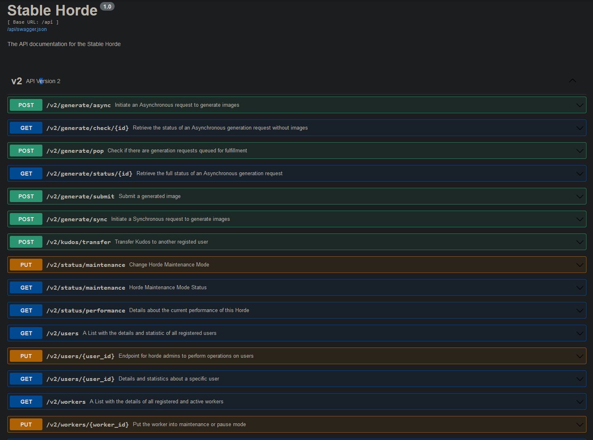

# Integrating to the AI Horde

This readme will provide information on how you can build software which uses the AI Horde

## REST API

First of all, we provide a fully open and self-documented REST API for all Generative AI functions we support.

[Complete Documentation](https://aihorde.net/api).



## SDK

We have multiple SDK for the AI horde

* [Python: pip](https://pypi.org/project/horde-sdk/) ([Documentation](https://horde-sdk.readthedocs.io/en/latest/))
* [Javascript: npm](https://www.npmjs.com/package/@zeldafan0225/ai_horde)

## The Basics

The workflow to use the AI horde is fairly straightforward.

First choose what kind of generation you want to have. Image, Text, or Alchemy (Image interrogation/manipulation). Depending on which one you'll use, you have to then use a specific set of endpoints.

They all work the same way. First send the payload which describes the generation you want to have. This is specific to the type of generation you want. This will return information about this request and will also even inform you if this request is even possible. You will receive an "id" here which you need to store to query in the next steps.

Once the request is accepted and in-progress, periodically check its status (the horde has a 1 second cache on status so there's no purpose checking more often). The status endpoint will inform you if it's done, how many underlying jobs are still in progress, waiting, or done.

If the request is done, retrieve the content from the `generations` key. This will either be a URL from which to download an image, or the resulting generation if it's text.

You can get the results faster by using the [webhooks](#Webhooks).

### Image Generation Endpoints

Use these endpoints to generate images. Please use the `/check` endpoint for checking if a request is done, and the statud endpoint for retrieving the full results.

1. Initiate the request: `api/v2/generate/async`
2. Check the request status: `api/v2/generate/check`
3. Retrieve the request results: `api/v2/generate/status`

### Text Generation Endpoints

Use these endpoints to generate text. 

1. Initiate the request: `api/v2/generate/text/async`
2. Retrieve the request results: `api/v2/generate/text/status`

### Image Alchemy

Use these endpoints to interrogate or manipulate images. 

1. Initiate the request: `api/v2/interrogate/async`
2. Retrieve the request results: `api/v2/interrogate/status`

## Webhooks

The AI Horde supports sending back the final generations as soon as they're delivered, using webhooks. 

To use the webhooks for generation, submit the URL to which the POST for the webhook should be delivered in the `webhook` key during submit.

As each job is fulfilled, a payload will be sent to that webhook, containing similar information you would receive from the `status` endpoint.

Below you will find the webhook json payload for each type of generation

### Image

```
{
  "img": "<IMAGE URL: STR>",
  "seed": <IMAGE SEED: INT>,
  "worker_id": "<WORKER ID: STR>",
  "worker_name": "<WORKER NAME: STR>",
  "model": "<MODEL NAME: STR>",
  "id": "<JOB ID: STR>",
  "gen_metadata": <GENERATION METADATA: LIST[DICT]>,
  "request": "<REQUEST ID: STR>",
  "kudos": <KUDOS CONSUMED: INT>
}
```
### Text

```{
  "text": "<TEXT URL: STR>",
  "seed": <TEXT SEED: INT>,
  "worker_id": "<WORKER ID: STR>",
  "worker_name": "<WORKER NAME: STR>",
  "model": "<MODEL NAME: STR>",
  "id": "<JOB ID: STR>",
  "gen_metadata": <GENERATION METADATA: LIST[DICT]>,
  "request": "<REQUEST ID: STR>",
  "kudos": <KUDOS CONSUMED: INT>
}
```
### Alchemy

```{
  "form": "<FORM TYPE: STR>",
  "state": <FORM STATE: STR>,
  "result": "<FORM RESULTS: DICT>",
  "worker_id": "<WORKER ID: STR>",
  "worker_name": "<WORKER NAME: STR>",
  "id": "<JOB ID: STR>",
  "request": "<REQUEST ID: STR>",
  "kudos": <KUDOS CONSUMED: INT>
}
```