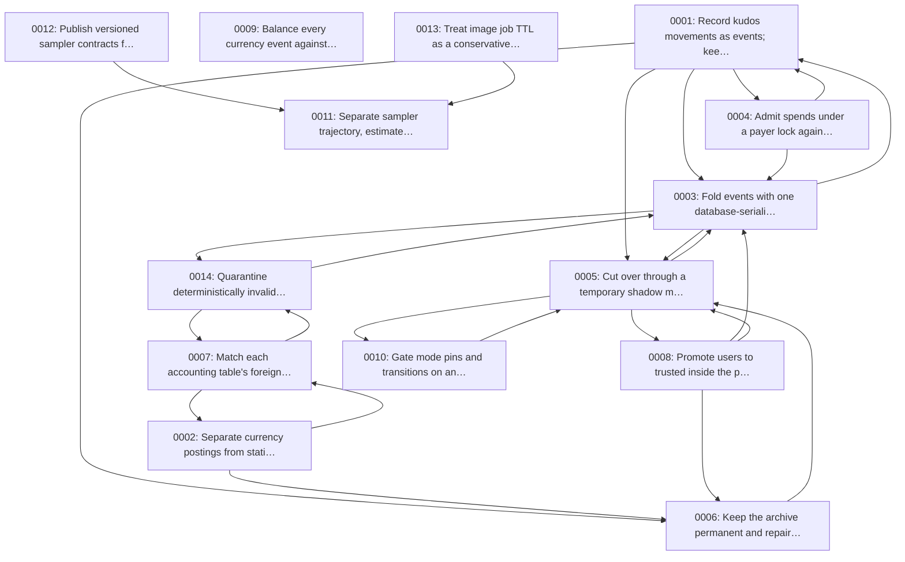

<!--
SPDX-FileCopyrightText: 2026 Tazlin

SPDX-License-Identifier: AGPL-3.0-or-later
-->

<!-- Generated by gen_adr_index.py; edit the records, not this file. -->

# Decisions

One decision per record: what was chosen, what was rejected, and what it cost.

| Record | Status | Date |
| --- | --- | --- |
| [Record kudos movements as events; keep balances as projections](0001-event-sourced-kudos-accounting.md) | accepted | 2026-07-24 |
| [Separate currency postings from statistic postings](0002-separate-currency-and-statistic-event-tables.md) | accepted | 2026-07-24 |
| [Fold events with one database-serialized projector](0003-single-serialized-projector.md) | accepted | 2026-07-24 |
| [Admit spends under a payer lock against reserved availability](0004-payer-reservations-for-spend-admission.md) | accepted | 2026-07-24 |
| [Cut over through a temporary shadow mode](0005-shadow-mode-cutover.md) | accepted | 2026-07-24 |
| [Keep the archive permanent and repair only by compensation](0006-permanent-archive-compensation-only-repair.md) | accepted | 2026-07-24 |
| [Match each accounting table's foreign keys to its lifetime](0007-accounting-foreign-key-policy.md) | accepted | 2026-07-24 |
| [Promote users to trusted inside the projector](0008-trust-promotion-in-the-projector.md) | accepted | 2026-07-24 |
| [Balance every currency event against system accounts](0009-balanced-events-via-system-accounts.md) | proposed | 2026-07-25 |
| [Gate mode pins and transitions on an advisory lock](0010-advisory-lock-mode-gate.md) | accepted | 2026-07-25 |
| [Separate sampler trajectory, estimated work, and execution ceilings](0011-separate-sampler-trajectory-estimate-and-ceiling.md) | accepted | 2026-08-18 |
| [Publish versioned sampler contracts from one authoritative registry](0012-publish-versioned-sampler-contracts.md) | accepted | 2026-08-18 |
| [Treat image job TTL as a conservative prefetch lease](0013-image-job-ttl-is-a-prefetch-lease.md) | accepted | 2026-08-18 |
| [Quarantine deterministically invalid statistic events without stopping the projector](0014-quarantine-deterministically-invalid-statistic-events.md) | accepted | 2026-08-30 |

## Relationships

An edge points from a record to a record it references.

