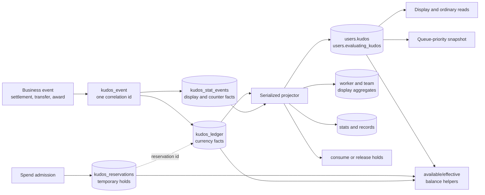
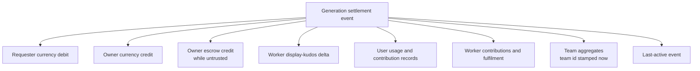
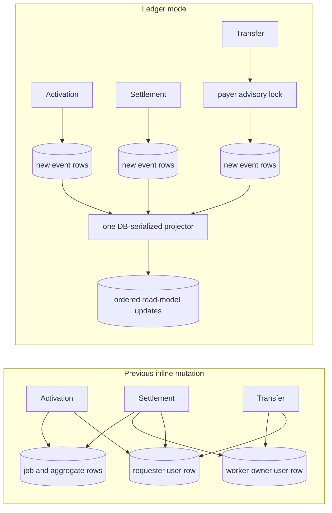
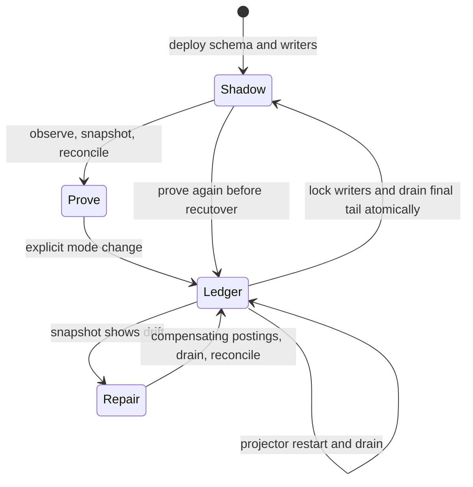

<!--
SPDX-FileCopyrightText: 2026 Tazlin

SPDX-License-Identifier: AGPL-3.0-or-later
-->

# Kudos accounting, projection, and concurrency

Today, a kudos-changing business transaction records signed, typed events instead of treating the current balance
columns as the complete history of what happened. Currency movements go to the append-only `kudos_ledger`;
display totals and non-currency statistics go to `kudos_stat_events`. In `ledger` mode, a database-serialized
projector folds those events into the familiar user, worker, team, and statistics columns. Spend admission uses
single-payer reservations so it remains safe while the visible balance is catching up.

Previously, request activation, settlement, transfers, uptime rewards, trust promotion, awards, and administrative
adjustments changed the materialized rows directly inside their request transactions. The current columns were both
the mutation mechanism and the only practical accounting record. That made frequently used user rows part of many
otherwise unrelated transaction lock graphs, made multi-account operations sensitive to lock order, and left no
general replay or compensating-repair path. The new mechanism separates the durable fact that a movement occurred
from the eventually updated read models. A deliberately temporary `shadow` mode records the same events while
retaining the old inline projection, permitting comparison and an online, reversible cutover.

This page explains why that shape exists and the limits of the guarantees. The exact mutation rules and the
consumer inventory are in the [kudos accounting reference](../reference/kudos_accounting.md). The operator sequence
for cutover, rollback, and repair is in [kudos ledger operations](../how-to/kudos_ledger_operations.md). For the
user-facing purpose of kudos, see [What are kudos?](../haidra-assets/docs/kudos.md).

## The problem is shared mutable rows, not arithmetic

A kudos settlement sounds like addition and subtraction, but one completed job updates a connected set of state:

- the requester's spendable balance, usage totals, records, and last-active time;
- the worker owner's spendable or evaluation balance;
- the worker's display kudos, contribution total, fulfilment count, and action buckets;
- the worker's team aggregates, using the team membership at settlement time; and
- the waiting prompt, processing generation, reservation, and transfer metadata that make the business event valid.

The old implementation performed much of that work inline. Concurrent activation and settlement transactions could
reach the same user and job rows through different paths. A transfer necessarily involved two users. Even when every
individual update was correct, inconsistent acquisition order could form a cycle: transaction A held a prompt or
source user while waiting for another user, while transaction B held that user and waited for A's row. Retrying a
deadlock victim prevents some user-visible failures, but it does not remove the contention or provide an audit trail.

The same design also coupled correctness to timing. Read-then-insert statistics could race on the first dimension
row; a crash between related updates was difficult to explain after the fact; a retry could repeat money without a
stable business key; and correcting a balance meant overwriting the only visible value rather than adding an
auditable compensating fact.

The initiative therefore solves four related problems:

1. shrink and standardize the lock graph for kudos mutations;
2. make currency movement durable, typed, correlated, and replayable;
3. preserve spend safety while projection is asynchronous; and
4. make cutover, rollback, diagnosis, and repair explicit operations rather than improvised database edits.

## The mental model: facts, holds, and projections

There are three different kinds of state. Treating them as interchangeable is the easiest way to introduce an
accounting bug.



**Facts** answer “what movement was accepted?” A `KudosLedger` row is one signed two-decimal currency delta against
one user's spendable or evaluation balance. A `KudosStatEvent` row is one non-currency or display delta. Rows from the
same business event share an `event_id`, but each row remains independently claimable and auditable.

**Holds** answer “what has already been promised?” A reservation belongs to exactly one payer and has a stable
`business_id`. It prevents two concurrent admissions from both relying on the same not-yet-projected balance. It is
not currency and never credits a recipient.

**Projections** answer “what should existing readers see cheaply?” `users.kudos`, `workers.kudos`, the team totals,
and the existing statistics tables remain denormalized read models. In ledger mode they can lag accepted events by a
projector interval. They are not discarded because queueing, API responses, leaderboards, and existing integrations
need inexpensive reads.

This separation also explains why worker “kudos” do not belong in the currency ledger. `workers.kudos` is a display
total attributed to a worker; the actual currency credit belongs to the worker owner in `users.kudos`. Likewise,
contributions and fulfilments are measured in things or counts. Mixing them into one table would make conservation,
reconciliation, and future reporting ambiguous.

## One business event, several postings

The `kudos_event` context assigns a shared event UUID and optional job metadata to related postings. For example, a
normal generation settlement can produce all of the following without directly editing the corresponding read-model
rows in ledger mode:



The exact set varies with trust, cancellation, fake generations, shared keys, and job type. The important invariant is
that the business transaction commits its job state and emitted facts together. The event UUID supplies correlation;
it does not by itself make every producer retry idempotent. Transfers accept a caller idempotency key and validate a
replay. Other producers still depend on their existing job-state transaction to prevent duplicate settlement.

## Projection is a durable work queue

In ledger mode, rows start with `applied = false`. The periodic projector:

1. tries to acquire a PostgreSQL transaction advisory lock, independent of the process-level quorum;
2. claims bounded, ID-ordered currency and statistics batches with `FOR UPDATE SKIP LOCKED`;
3. groups deltas by target and visits materialized targets in stable primary-key order;
4. updates balances, counters, records, worker totals, and team totals;
5. consumes or releases the matching reservations;
6. marks the exact claimed row IDs applied; and
7. commits all those changes in the same database transaction.

If the process dies before commit, neither the projection nor the applied flags commit. A later cycle sees the rows
again. If a lower numeric ID commits after a later row was already processed, it remains `applied = false` and is
claimed by a later cycle; there is no high-water mark that can skip it. “Exactly once” here means exactly one
committed fold of an accepted row, not exactly-once creation of arbitrary business events.

The applier heartbeat is deliberately not a correctness watermark. It only makes a stopped or delayed projector
observable. Applied currency and statistic events are retained permanently; the pruning hook is a compatibility
no-op.

## Why this reduces deadlocks

The design is better at preventing the deadlock class that motivated it because ordinary producers append new rows
instead of acquiring write locks on hot user, worker, team, stats, and record rows. Multi-account transfers serialize
on the payer only and never lock a recipient for admission. Projection is moved to one database-serialized writer,
which accumulates a batch and applies each target class in a stable order.



The claim is intentionally narrower than “deadlocks are impossible.” Activation and settlement still change job
state, relationships, shared-key budgets, and other non-ledger rows. Database maintenance or unrelated code can also
lock a projection target. The bounded PostgreSQL deadlock retry on waiting-prompt activation remains for those cases.
The projector itself can be blocked, and its single-writer design trades write parallelism for a much simpler lock
graph. Queue age, heartbeat age, and database deadlock metrics must therefore be monitored after cutover.

The accounting-specific lock order is:

```text
mode transition: applier advisory lock -> control-row exclusive lock -> final fold
projector:        applier advisory lock -> event rows -> ordered projection targets -> reservations
producer:         control-row key-share lock -> optional payer advisory lock -> appended rows
reconciliation:  repeatable-read snapshot; repair emission also takes the reconciliation advisory lock
```

Every mutation transaction pins the observed mode by holding a key-share lock on the control row until commit. An
exclusive mode change therefore waits for old-mode writers to finish before the new ownership rule becomes visible.
The transition back to shadow takes the applier lock first, waits for those writers, and folds the final ledger tail in
the same transaction. This prevents an old ledger-mode posting from appearing after inline projection resumes.

## Reservations make eventual balances spend-safe

Asynchronous projection means `users.kudos` alone cannot answer whether another debit may be accepted. A user could
have 100 visible kudos, submit two simultaneous 80-kudos transfers, and appear solvent to both transactions if their
debits only exist as pending ledger rows.

Admission closes that window with a transaction-scoped advisory lock derived from the payer's ID. Under that lock,
`available_kudos` subtracts the account floor, active holds, and ordinary queued debits while deliberately ignoring
queued credits. The accepted operation creates or reactivates a uniquely named reservation in the same transaction
as its ledger posting. Projection consumes request holds as their debits fold and releases transfer holds only when
the complete event has folded, including a transfer split across batches.

This is conservative by design: a queued credit cannot fund a new spend until it is projected. Conservatism can delay
work during projector lag, but it cannot authorize an overspend on the strength of unmaterialized income.

`effective_kudos` serves a different purpose. It adds all committed, unprojected currency deltas to the materialized
balance and clamps the result to the account floor. It is appropriate for a “new balance” response or diagnosis, not
for spend authorization, because it includes queued credits and does not represent holds.

## Compatibility rules that remain visible

The ledger changes mutation mechanics, not the established economic policy:

- A debit cannot take an account below `get_min_kudos()`. If projection forgives part of a debit, it emits an already
  applied `FLOOR_ADJUSTMENT` for the created amount so replay remains linear.
- Untrusted worker-owner rewards go wholly or partly to `evaluating_kudos`, depending on reward type. The projector
  detects the final threshold-crossing contribution, grants trust, and emits an escrow-debit/spendable-credit pair.
  This avoids requiring a later request to trigger promotion.
- Worker and team aggregates retain historical attribution. The producer stamps the worker's current `team_id` on
  the event, so moving the worker before projection cannot move old credit to a new team.
- Shared-key kudos remain an inline per-key quota. They are not user currency and are not projected by this ledger.
- Job cost fields such as `waiting_prompts.kudos` and `consumed_kudos` are prices and job-local accounting, not account
  balances.

Some ordinary reads intentionally remain eventually consistent. Queue priority is copied from the materialized user
balance when a request or interrogation is activated; API and login display paths generally expose materialized
balances; and the image-worker upfront eligibility recheck still reads the materialized balance even though initial
admission is protected by a reservation. Those paths can be stale by the projector lag. They do not authorize a
second spend, but they can temporarily show an old value or make a conservative/optimistic scheduling decision. The
[consumer inventory](../reference/kudos_accounting.md#consumer-and-read-model-inventory) records these sites so a
future change can deliberately choose `available_kudos`, `effective_kudos`, or the projection rather than blindly
replacing every `.kudos` read.

## Shadow mode is a migration mechanism, not a second architecture

New and migrated databases begin in `shadow` mode. Business methods always emit the new typed events. A small
compatibility projector applies the historical inline mutations and marks the emitted rows already applied. This
provides permanent audit evidence without replaying a movement that already changed its target. The asynchronous
projector's trust-promotion and escrow-drain duties run only in ledger mode; in shadow mode the compatibility
projector owns them, so shadow observation changes no balance the previous code would not have changed.

The mode branch is confined to `horde/database/kudos_legacy_projection.py`, the control helpers, and the
applied-flag choice inside the two emission primitives. Removing the
cutover period should therefore be a small, reviewable deletion: remove the compatibility calls/module and the shadow
mode transition, while leaving producers, event schemas, reservations, and the ledger projector intact. It must not
be implemented by scattering feature checks through settlements and endpoints.

Shadow history is a forward audit beginning at deployment; it is not a reconstruction of all kudos ever created.
The existing materialized balances form the opening position. A transaction-consistent snapshot records that opening
position together with the applied-ledger totals visible at the same time.

## Recovery is compensation, not history editing

The permanent event archive and balance snapshots make recovery demonstrable:



A snapshot uses repeatable-read isolation and records each user's materialized spendable/escrow values plus the
applied ledger totals at that point. Reconciliation computes the expected current values from that baseline and later
applied events. Read-only reconciliation reports drift. Repair mode emits deterministic `RECONCILIATION` postings;
it never rewrites a balance, deletes a posting, or changes an old `applied` flag. Re-running the same repair cannot
duplicate it.

If the projector stops, accepted rows remain durable and unapplied: restore the projector and drain. If projection is
wrong, preserve evidence, reconcile from a known snapshot, review all drift, emit compensation, drain, and reconcile
again. If ledger ownership itself must be rolled back, switch to shadow through the control helper so the final tail
is folded atomically. Rolling directly back to code that does not understand reservations and shadow audit events is
unsafe.

This recovery model is why the archive is not pruned and why an operator must never “fix” an incident by toggling
`applied`, deleting events, or assigning balances directly. The operational commands and rehearsal checklist are in
[kudos ledger operations](../how-to/kudos_ledger_operations.md).

## Costs and boundaries

The architecture deliberately accepts several costs:

- Normal balance and aggregate reads are eventually consistent in ledger mode.
- One projector limits write throughput; bounded batches, a small interval, and a bounded per-tick catch-up loop are
  the scaling controls. Sharding it would require a new ordering and reservation design, not merely more threads.
- The permanent archives grow without automatic pruning and need capacity planning.
- PostgreSQL provides the production concurrency guarantees, and the unit suite runs against PostgreSQL. The SQLite
  code branches serve the legacy `USE_SQLITE` runtime mode only; they short-circuit advisory locks and prove nothing
  about concurrent-projector behavior.
- Projection exactly-once does not automatically make every producer idempotent. New externally retryable mutations
  need a stable idempotency key and parameter-conflict behavior.
- Reconciliation covers user currency and evaluation escrow. Derived statistics are auditable and replayable from
  `kudos_stat_events`, but the current snapshot/repair command does not reconcile every worker, team, or counter row.

These are preferable to an implicit, distributed lock graph, but they are still operational obligations. A safe
cutover requires shadow evidence, PostgreSQL concurrency tests, a current snapshot, a clean reconciliation, healthy
queue lag, and a rehearsed return to shadow before ledger mode becomes authoritative.
